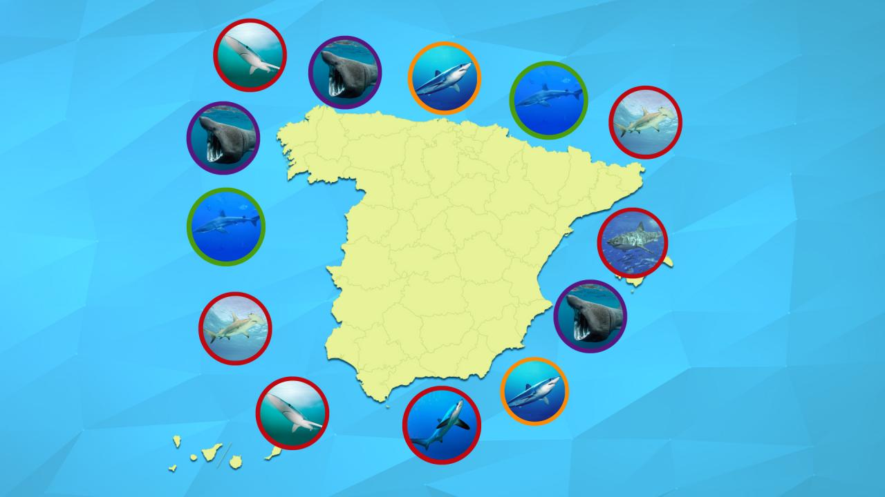

# pandas-project

ataques de tiburones

## importar archivo csv
data=pd.read_csv("GSAF5.csv",engine="python")

## importar las librerias necesarias
import pandas as pd
import numpy as np
import re

## examinar la base de datos
llamada data.csv

## analisis por columnas

## limpieza de valores NaN

## creacion de tabla con los ataques ocurridos en España
llamada spain.csv

## limpieza y examen a la nueva tabla

## conclusiones finales:

   *los ataques de tiburones que se produjeron en costas españolas, el 100% de las mujeres vivieron y de los hombres, el 33% murio.

   *En Baleares hay 100% de posibilidades de que si te ataca un tiburon sea mortal, y en Valencia te salvas al 100%.

   *La actividad que prefieren los tiburones atacar es nadar, seguido de la pesca y el baño.

   *Aunque la actividad mas frecuente de ataque sea nadar(10 ataques fallidos por 3 muertes), es mas peligroso caerse de un barco(0 fallidos por 2 muertes) o bañarse (2 fallidos por 2 muertes)
    
## Useful Resources

   *Pandas Documentation
   *Pandas Tutorials
   *StackOverflow Pandas Questions
   *Awesome Public Data Sets
   *Kaggle Data Sets
   
   
   
